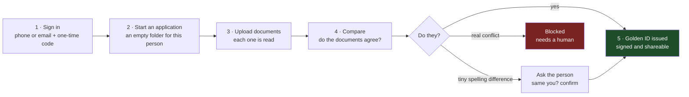
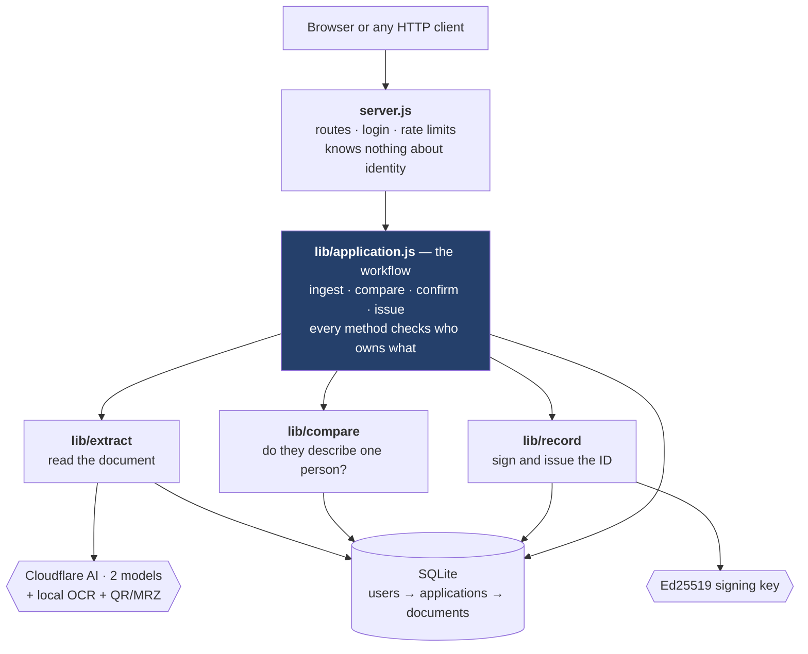
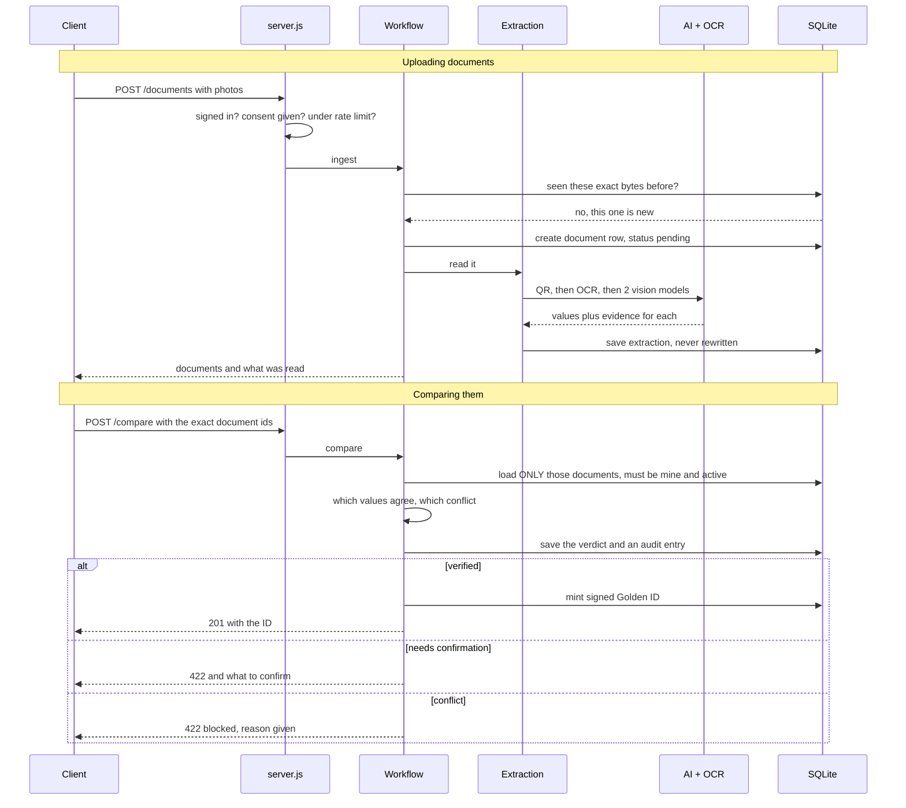

# Golden ID — backend flow, in plain terms

Three diagrams. The first is what happens, the second is where the code lives,
the third is the actual conversation between the parts.

---

## 1. What happens, start to finish

An **application** is the boundary that matters: a document belongs to exactly
one application, and nothing can ever reach across from another.

---

## 2. Where the code lives

Read it top to bottom: **HTTP layer** never touches identity logic, the
**workflow** owns every rule about ownership and consent, the **engines** do
one job each, and everything lands in one small database.

---

## 3. The two calls that matter

---

## The API in one table

| Call | What it does |
|---|---|
| `POST /auth/request-otp` → `verify-otp` | Sign in, get a session token |
| `POST /applications` | Start a fresh application |
| `GET /applications/:id` | Resume it later — this is what a refresh uses |
| `POST /applications/:id/documents` | Upload and read documents |
| `PATCH /…/documents/:docId/field` | Correct one field by hand |
| `DELETE /…/documents/:docId` | Remove a document from the application |
| `POST /applications/:id/compare` | Compare the documents you name |
| `POST /applications/:id/confirmations` | "Yes, that's the same person" |
| `GET /applications/:id/verdict` | Fetch the last result |
| `POST /records/:gid/share` | Make a limited, expiring share link |
| `GET /cards/:gid?token=…` | A verifier reads only the shared fields |
| `GET /.well-known/golden-id-key` | Public key, so anyone can check the signature |

---

## Four rules the backend never breaks

1. A document is reachable **only** through the application that owns it.
2. What was read from a document is **never edited** — corrections live apart.
3. Only values we could actually **verify** are allowed to agree or disagree.
4. Anything the applicant typed themselves is labelled as such, always.
