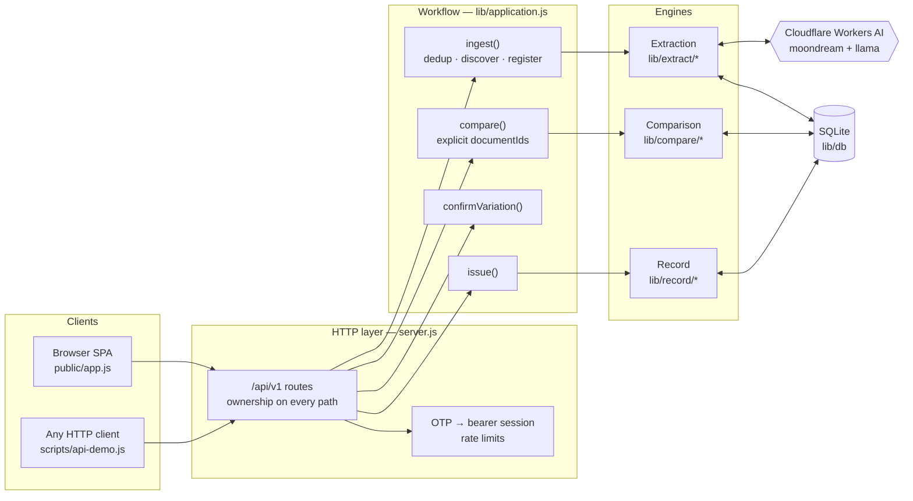
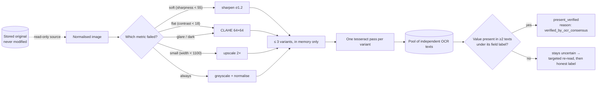
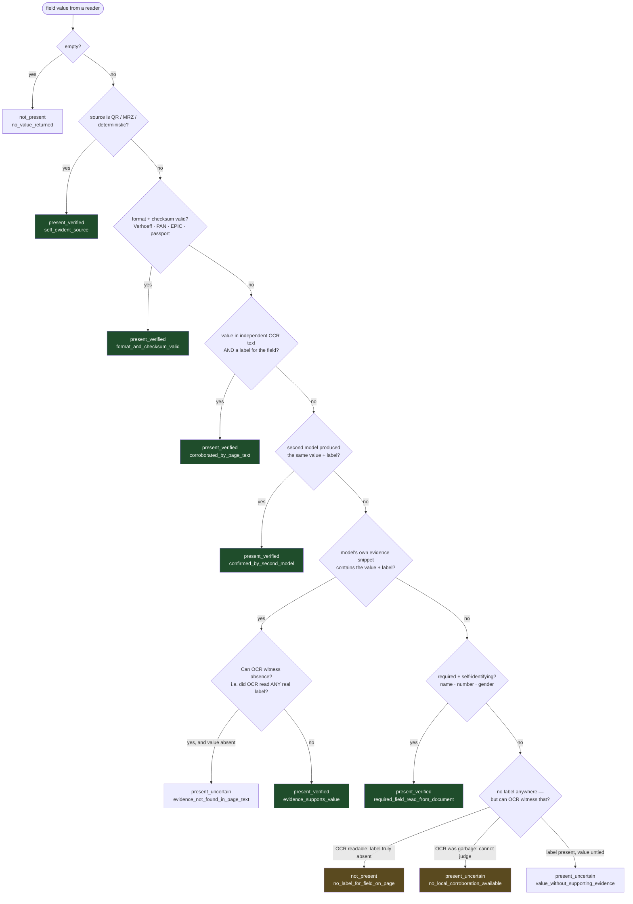
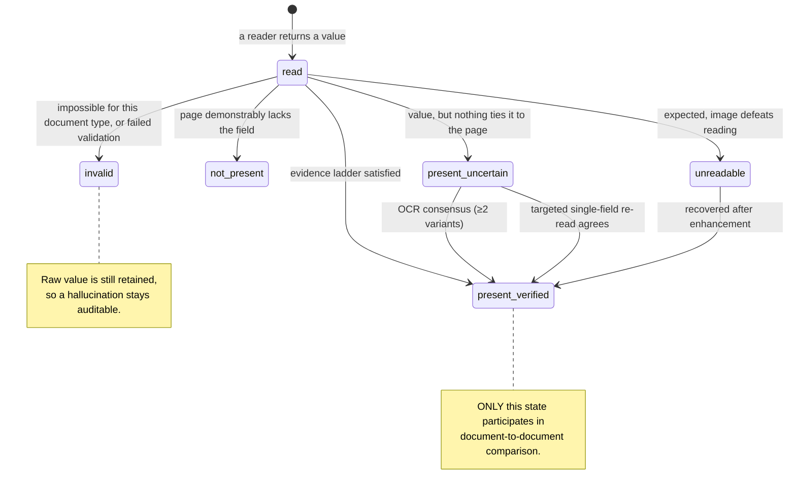
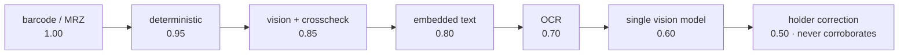
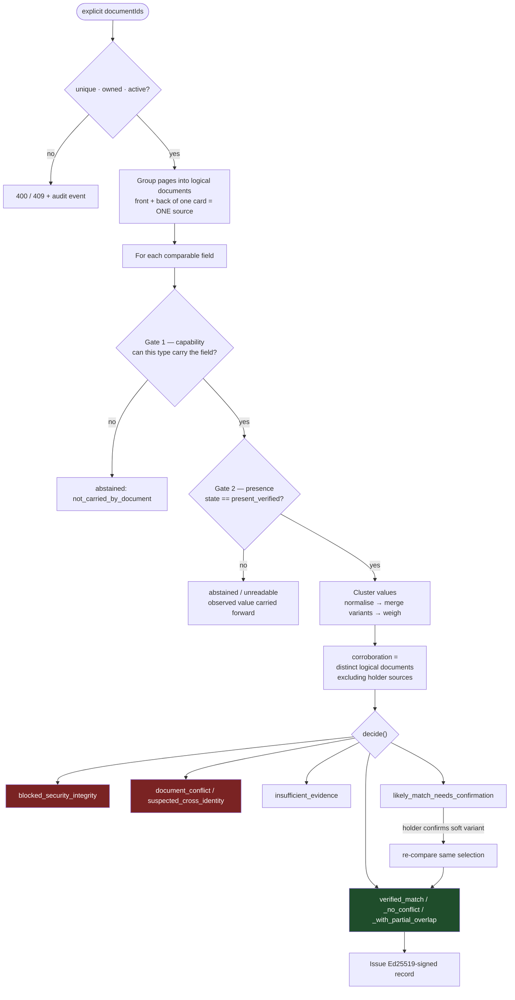
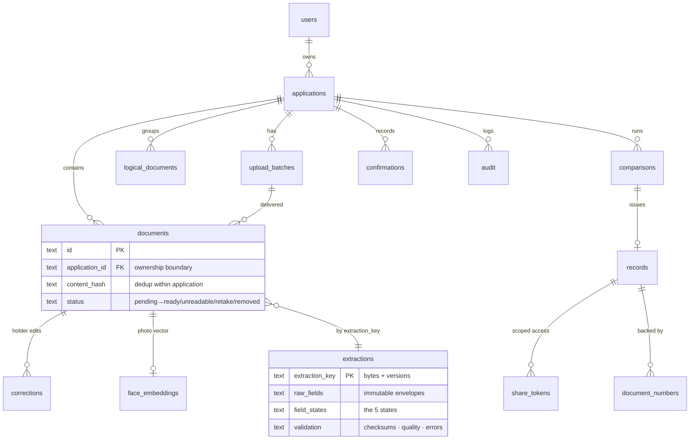

# Golden ID — Extraction Architecture

How a photograph of an identity document becomes evidence, and what stops it
from becoming a guess. Every diagram below reflects the code as it actually
runs (`EXTRACTOR_VERSION 3.2.0`).

---

## 1. System overview



---

## 2. The extraction pipeline — `extractOne()`

The order is deliberate: **cheap and certain first, expensive and fallible
last.** Deterministic sources (QR, MRZ) are read before any model, so a model
can never override checksummed truth.

```mermaid
flowchart TD
    START(["buffer + mimeType"]) --> KEY["Compute extraction key<br/>sha256(bytes + extractor + prompt + schema + models)"]
    KEY --> CACHE{"Cached?"}
    CACHE -->|hit| CACHED["Return cached extraction<br/>quality-gate verdict preserved"]
    CACHE -->|miss| NORM["2 · Normalise image<br/>EXIF rotate · max 2400px · JPEG q92"]

    NORM --> QUAL["Assess quality<br/>sharpness · glare · exposure · contrast · resolution"]
    QUAL --> TIER{"Tier?"}
    TIER -->|unusable| GATE["3 · Quality gate<br/>save empty extraction<br/>status: retake_required"]
    GATE --> RETAKE(["Specific reason + camera guidance"])

    TIER -->|good| QR
    TIER -->|marginal| QR

    QR["4 · Aadhaar Secure QR<br/>zxing-wasm → inflate → fields"] --> OCR["5 · Local OCR — tesseract eng+hin<br/>INDEPENDENT of the model"]

    OCR --> MARGINAL{"tier == marginal?"}
    MARGINAL -->|yes| ENH["5b · Blur recovery<br/>≤3 enhancement variants<br/>one OCR pass each"]
    MARGINAL -->|no| MRZ
    ENH --> MRZ["Parse MRZ from every OCR text<br/>ICAO 9303 check digits"]

    MRZ --> CLS1["6 · Classify from evidence<br/>weighted votes, margin ≥ 3"]
    CLS1 --> VIS{"Vision configured<br/>and not a text upload?"}
    VIS -->|no| FALLBACK["9 · OCR-only extraction"]
    VIS -->|yes| ID

    ID["7a · IDENTIFY pass<br/>generic prompt, 18 fields"] --> FOCUS["7b · FOCUSED read<br/>type-specific prompt, 5-6 fields<br/>kept only if it scores ≥ identify"]
    FOCUS --> CLS2["8 · Re-classify on what was read"]
    CLS2 --> XCHECK{"Cross-check needed?<br/>always · required field unverified · type unsure"}
    XCHECK -->|yes| SECOND["Second model<br/>llama-3.2-11b-vision"]
    XCHECK -->|no| MERGE
    SECOND --> MERGE

    FALLBACK --> MERGE["Merge readings<br/>same value → verified<br/>disagree → uncertain + candidates"]

    MERGE --> DET["10 · Deterministic overwrite<br/>QR / MRZ values win outright @0.99"]
    DET --> CLS3["11 · Final classification"]
    CLS3 --> REASSESS["Re-assess every field<br/>against the now-known type<br/>upgrades only"]

    REASSESS --> CONSENSUS["11b · OCR-consensus recovery<br/>value seen in ≥2 independent OCR texts<br/>under its label → verified"]
    CONSENSUS --> REREAD["11c · Targeted field re-read<br/>≤3 uncertain identity fields<br/>single-field prompt, 'return null, do not guess'"]

    REREAD --> PERSIST["12 · Persist immutable extraction<br/>rawFields · fieldStates · validation · classification"]
    PERSIST --> DONE(["Extraction record"])

    style GATE fill:#7a2323,color:#fff
    style DET fill:#1f4d2b,color:#fff
    style CONSENSUS fill:#1f4d2b,color:#fff
    style PERSIST fill:#25406b,color:#fff
```



### Why each stage exists

| Stage | Exists because |
|---|---|
| Cache by bytes **and** versions | A prompt or model change must never serve a stale read |
| Quality gate (unusable only) | Never read what cannot be seen — but never reject what recovery might rescue |
| QR / MRZ **before** models | Checksummed truth outranks any model; reading it first makes that structural |
| Local OCR as corroboration | The only witness independent of the model — this is what caught an invented DOB on a real Voter ID |
| Identify → focused (two prompts) | Asking a small model for 18 fields loses fields; asking for 6 does not |
| Cross-check model | Two independent readings agreeing is real evidence; one model's word is not |
| Consensus + re-read | Real phone photos defeat local OCR; a second independent look rescues correct reads without trusting a single claim |

---

## 3. Blur recovery (the `marginal` path)



**Honest limits.** Slight blur and compression are often recoverable. Moderate
blur yields uncertain evidence. Severe blur, glare, missing pixels or tiny
text are **not** recoverable — enhancement sharpens what the sensor captured;
it cannot recreate detail that was never captured.

---

## 4. How a value becomes a state — `assessField()`

Every field passes this ladder exactly once. First match wins.



> The `VETO` and `LABEL` branches are the fix for real photographs: local OCR
> that could not read a single field label off the page is **noise**, and
> noise is not allowed to testify that a value is absent.

---

## 5. Field states



A sixth state, **`holder_asserted`**, is produced by the database layer (not
by extraction) when the applicant types a value the document never showed. It
displays, it can unblock a required field, and it **never** counts as document
evidence.

---

## 6. Evidence strength ladder

Used to pick a cluster winner: strongest source first, total weight second.



A cluster containing any source ≥ 0.90 wins outright — two model guesses can
never outvote a checksummed read.

---

## 7. Comparison and decision



---

## 8. Module tree

```
lib/
├── application.js          workflow: ingest · compare · confirm · issue
├── config.js  flags.js  ratelimit.js  uploads.js
│
├── extract/                ── THE EXTRACTION ENGINE ──
│   ├── index.js            orchestration (the pipeline in §2)
│   ├── vision.js           Workers AI client + per-model adapters
│   ├── prompts.js          generic · type-specific · single-field re-read
│   ├── tesseract.js        local OCR (eng + hin) and label parsing
│   ├── classify.js         weighted-evidence document typing
│   ├── evidence.js         assessField — the ladder in §4
│   └── schema.js           envelopes · validation · reassess · JSON salvage
│
├── preprocess/
│   ├── index.js            MIME sniff · quality metrics · tiers · crop
│   └── enhance.js          blur-recovery variants (§3)
│
├── validate/
│   ├── formats.js          Aadhaar · PAN · EPIC · passport patterns
│   ├── checksums.js        Verhoeff · MRZ ICAO 9303
│   ├── repair.js           positional OCR repair
│   └── barcode.js          Aadhaar Secure QR decode
│
├── compare/
│   ├── index.js  cluster.js  decision.js  matrix.js
│   ├── names.js            10-step transliteration-aware cascade
│   ├── levenshtein.js  diff.js
│
├── normalize/              name · date · gender · address
├── schemas/registry.js     what each document type CAN carry
├── upload/                 discover (ZIP/PDF/MIME) · grouping (front/back)
├── face/                   detect · embed · match (advisory only)
├── record/                 consensus · dedup · issue (Ed25519)
└── db/                     index.js · schema.sql
```

---

## 9. Data model



**`extractions` sits deliberately outside the ownership chain**: it is keyed by
bytes and versions, so identical files are read once and shared — while every
application still gets its own `documents` row that only its owner can reach.

---

## 10. Invariants the design guarantees

1. The uploaded original is **immutable**; every enhancement is a derivative
   held in memory.
2. A stored extraction is **never rewritten** — corrections live in their own
   table and are applied on read.
3. Only `present_verified` participates in comparison.
4. A value the applicant supplied can never be presented as printed evidence,
   and never counts toward document agreement.
5. Corroboration counts **distinct logical documents** — one card can never
   corroborate itself.
6. Checksummed machine-readable evidence outranks every model.
7. Every verified value carries a reason code explaining *how* it was verified.
